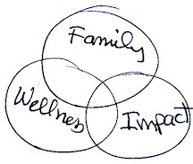

Some think coaching is for weak people who need a crutch.
In fact, coaching is for everyone, particularly for leaders who are already successful and are looking for further improvement.
It has helped me become a better [team leader](/pages/team/), advisor, and partner,
in my professional life, and is transforming my personal life.

For me, coaching is a partnership (with a coach) to chart my path forward.
I employed an executive coach while I was founding director of the
[Data Science Institute](https://datascience.wisc.edu/institute).
That helped me improve my leadership and build multiple partnerships to launch
a new type of campus entity. DSI is now thriving under its director,
and will be an integral part of the new
[School of Computer, Data & Information Sciences building](https://cdis.wisc.edu/building/).

Recently, I have been working with a retirement coach to chart a different
type of path forward.
This web site is only part of that path.

## Coaching Books and Resources

* [What is Retirement/Life Coaching?](https://www.newretirement.com/retirement/retirement-coach-can-help-you-have-a-better-retirement/)
* [What is Executive Coaching?](https://www.ccl.org/leadership-solutions/leadership-coaching/executive-coaching/)
* [Center for Creative Leadership (CCL)](https://www.ccl.org/)
* [Darcy Luoma Coaching](https://darcyluoma.com/)
* [Nancy Turngren Coaching](http://ntcoaching.com/)
* [Jody Gittell (2016) Transforming Relationships for High Performance](https://www.sup.org/books/title/?id=23433)
* [Bill Isaacs (1999) Dialogue and the Art of Thinking Together](https://books.google.com/books/about/Dialogue.html?id=cBbxXWEUFsoC)
* [Frederic Laloux (2014) Reinventing Organizations](http://www.reinventingorganizations.com/uploads/2/1/9/8/21988088/140305_laloux_reinventing_organizations.pdf)
* [Pat Lencioni (2002) The Five Dysfunctions of a Team](https://www.talentsquare.com/blog/book-summary-the-five-dysfunctions-of-a-team/)
* [Houston we have a Problem](https://en.wikipedia.org/wiki/Houston,_we_have_a_problem)
* [Influencer: the new science of leading change](https://docs.google.com/document/d/1jv_3e4Q4DCj878OEy3g_DE9GzXjvpUKNLPs59mtbBGE/edit#heading=h.s6mbs0xthvwz) by Joseph Grenny et al.
* [Bob Anderson](#bob-anderson)
* [Susan Cook-Greuter](#susan-cook-greuter)

## Bob Anderson

* [Mastering Leadership by Bob Anderson](https://www.amazon.com/Mastering-Leadership-Breakthrough-Performance-Extraordinary/dp/1119147190)
* [bob anderson Bio](https://leadershipcircle.com/wp-content/uploads/2020/10/Anderson-Bob-bio-MAY-2020.pdf)
* [leadership circle profile bob Anderson](https://leadershipcircle.com/wp-content/uploads/2020/10/Anderson-Bob-bio-MAY-2020.pdf)**
* [Leadership Circle--Self-Assessment](https://self-assessment.theleadershipcircle.com/welcome) 
([Tool](https://self-assessment.theleadershipcircle.com/en-US/reports))

basic idea

* socialize mind
* self-authoring mind
* transformation to more creative mindset
* bottom : reactive
* top :: creative, self-authoring

### Mastering Leadership

Anderson, Robert J.; Adams, William A.. Mastering Leadership: An Integrated Framework for Breakthrough Performance and Extraordinary Business Results (p. xvii). Wiley. Kindle Edition. 

### Introduction

* complete leadership development model, system, and process designed to be powerfully transformative and take your leadership to the next level of effectiveness
* first integrated model of what constitutes leadership effectiveness and how it develops, complete with ways to measure and track progress against that model
* better model of leadership
    * Integrates best theory and research on leadership, human, and spiritual development, and reflects complexities that leaders face today
    * Shifts understanding of extraordinary leadership and how to champion its development 
    * dynamic: change limiting belief and associated behavior to yield predictable effective behaviors and results
* second half: deep inner work

### 1 The Promise of Leadership

explicit vs implicit expectations

high bar of experiences & expectations

leadership matters

**4 universal promises of leadership**

* Set the right direction and create meaningful work
* Engage all stakeholders and hold them accountable for performance
* Ensure that processes and systems facilitate focus and execution
* Lead effectively—maintain relationships of trust to achieve and sustain desired results

broken leadership promises

keeping the promise

leadership agenda

### 2 Leadership Effectiveness and Business Performance

what research shows

what is your leadership quotient?

provocative questions

collective effectiveness

CE & intelligence

### 3 Mastery and Maturity, Consciousness and Complexity

triumph and failure of inner game

competence is only half the game

**2 games of leadership**

* outer game
    * leadership process
        * science of leadership
        * business rhythm & management process
    * leadership competencies
        * outside game of leadership
        * leadership competency research
* inner game
    * leadership consciousness
        * inside game of leadership
        * evolving consciousness

inner game runs the outer game

litany of literature

**4 foundational premises**

* structure determines performance
* you are a structure
* consciousness is operating system of performance
* to achieve higher performance, you must be restructured

consciousness & complexity

understanding complexity: redundant polarities & problems

non-obvious points of leverage

leadership imperative

core argument

uncommon sense

collective wisdom

global leadership imperative

### 4 Stages of Development

stages of development framework

* egocentric: self-sovereign mind
* reactive: socialized mind
* creative: self-authoring mind
* integral: self-transforming mind
* unitive

universal model of leadership

correlation conclusions

trajectory of life-long development

childhood: seeing development the easy way

identity as core

### 5 Five Levels of Leadership

* egocentric leadership
* reactive leadership
* creative leadership
* integral leadership
* unitive leadership

### 6 The Universal Model and Metrics

task & relationship: horizontal axis

dynamic model

optimal leadership

link to performance & effectiveness

dynamic polarities

* complying to achieving
* controlling to relating
* protecting to creative (self aware, authentic, systems aware)

universality of model

case in point: cross-cultural application in rural Uganda

gender & universal model

stage of development research

conclusions & implications 

### 7 The Leadership System

**6 systems of organizational effectiveness**

1. leadership
* vision & value
* strategy & approach
* structure & alignment

leadership system goals

* translate vision & value into strategy & approach
* to develop an effective structure & ensure alignment
* towards achieving results

leadership system responsibilities

* evolve consciousness of leadership to transform culture 
* use metrics to track operations, opportunities, improvements, leadership effectiveness
* create meaning, set context, maintain conditions to thrive
2. communication

big idea

* effective communication creates organizational meaning
* organizational meaning produces context in which to operate

actions of leader to create on-the-table culture

* attend to quality of daily conversations
* engage authentically encourage moments of truth through example
* align people around common cause

guided culture

* create meaning, provide focus, reduce uncertainty, challenge excuses
* learn from experience, treat mistakes as intellectual capital
* leverage power of leadership decisions to shape beliefs and behaviors

3. accountability
  * clarify what is important and what is expected of people
  * align consequences for efforts with actual performance

4. delivery
  * simple processes that are internally efficient, locally responsive, and globally adaptable.

5. performance
6. measurement

whole systems approach to developing leadership

**4 compelling case studies**

1. EverBank Commercial Finance
2. Global Shared Services, McDonald's Corp
3. Honda Precision Parts of Georgia
4. Technology Service Provider

owning development from the top

### 8 Reactive Leadership

performance review

leave ego at door

dare to tell truth

**2 primary movements**

* motive: safety to purpose
    * approval to vision
    * reactive to creative structure of mind
* identity: outside in to inside out

structure of reactive mind

* problem threat, fear, reaction

core operating beliefs

putting it all together

leadership agenda

### 9 Reactive Leadership at Work

moving from patriarchy to partnership

navigating 2 journeys

**3 core reactive types**

* heart: complying
* will: controlling
* head: protecting

gifts of each type

gifts hun on reactive structure

reactive dynamics: true to type

reactive type dynamics in universal model

natural selection process: creating collective patterns of patriarchy

### 10 Creative Leadership

performance review

hero's journey

what transition looks like

talking about it without knowing it

creative structure

creative structure of identity

restructuring identity beliefs

designed for leading change

creative mind & performance

alignment

path of development: move toward near enemy

type through stage

creative organizations

integration

literacy in pathways of transformation

**2 currents of transformation**

### 11 Six Leadership Practices

1. discerning purpose
2. distilling vision
3. knowing doubts & fears
4. engaging in authentic, courageous dialogue
5. developing intuition, open to inspiration
6. thinking systematically

path of mastering leadership

### 12 Integral Leadership

brief summary of stages

servant of system

maturing intuition

seeing entire development spectrum

holding unresolvedness, conflict, tension

as within, so without

meeting of 2 opposites

have you ever asked me what I want?

shadow side of universal model

fierce compassion, dance of enemies

why is change so difficult?

integral leadership imperative

### 13 Unity

waves on ocean

* We surf on the ocean
* Ocean is separate from our wave-ness
* we experience the ups and downs of wave life
    * We love the ups and strive for them
    * We fear the downs and work to avoid them
* Ultimate fulfillment: awake from the dream of our separate wave-ness
* we were always one with the Ocean, never separate, all waves are one
* we are eternal ocean itself, and there is no death, only a change of form
* there is only abiding love, bliss, joy, and freedom

no self, all god

development turned upside down

* movement into Unity is different
* ego is not matured into Unity—it is surrendered
* you must forget yourself

**2 arguments for development**

* if you want to develop mastery in the art of leadership, a mature Structure of Mind is required.
* development into mature Structures of Mind and Identity is preliminary to breakthrough to Unity, the arduous work of surrendering identity altogether

not me, not me

* Adolescence to Reactive Mind: not independent capability to meet egocentric needs
* Reactive to Creative Mind: not external identity needing outside validation for worth and security
* Creative to Integral Mind: not hard-earned, self-authoring, authentic version of ourselves 
* we are many selves, perhaps even all selves

unity leadership

* we need mature leadership to emerge to make critical difference in planet outcome
* requires Integral Mind leading from presumption of our inherent Unity
* find global systemic solutions that usher in a thriving future for all planet inhabitants 
* Leadership Imperative

### Appendix 1 Leadership Circle Profile Dimensions

### Appendix 2 Theorists Integrated into The Leadership Circle Universal Model of Leadership

## Susan Cook-Greuter

* **Integral+Life: adult developmental process**
    * [Susanne Cook-Greuter](https://integrallife.com/author/susanne-cook-greuter/) ([LinkedIn](https://www.linkedin.com/in/susanne-cook-greuter-60056322b/)) 
    * [https://verticaldevelopment.com/](https://verticaldevelopment.com/) 
    * [The Stages of Leadership Maturity – Integral Life](https://integrallife.com/stages-leadership-maturity/) 
    * [Deep Transformation Podcast](https://deeptransformation.io/?s=cook-greuter) 
    * [Cook-Greuter, Susanne | Institute of Coaching](https://instituteofcoaching.org/author/cook-greuter-susanne) 
    * [Maturity Assessment Profile (MAP) - Fenix Leadership Consulting](https://www.fenixleadershipconsulting.com/services/coaching/map-assessment/)
    * [THE MAP](https://robinsoncoaching.com/wp-content/uploads/2020/03/Doc_B___MAP_Brochure_Combo_Sept_2019.pdf)
* [Integral Life Images](https://integrallife.com/stages-leadership-maturity/#gallery-image/2)

Horizontal development: acquires experience and knowledge, as well as new skills and competencies

Vertical development: fosters growth of new perspectives and greater ability to handle difficult problems

* O'Fallon T, Polissar N, Neradilek MB, Murray T (2020) [The validation of a new scoring method for assessing ego development based on three dimensions of language](https://www.ncbi.nlm.nih.gov/pmc/articles/PMC7090352/). Heliyon. 2020 Mar; 6(3): e03472.
  * validity of a new theoretical framework and scoring methodology (STAGES)
  * for sentence completion tests of meaning-making maturity or complexity (ego development or perspective-taking capacity)
  * builds upon Sentence Completion Test of Jane Loevinger as updated by Susanne Cook-Greuter
  * structural explanation in three dimensions
    * polar factors: individual/collective and passive/active
    * categorize sophistication of types of objects (concrete, subtle/abstract, "metaware")

### From LinkedIn

After 4 decades, … I now focus on writing about my discoveries and concerns…. I shifted my attention from adult development theories to re-exploring values and character development…. I [am] writing the book on ego development theory from a perspective that includes an appreciation of [non-WEIRD definitions](https://wiki.p2pfoundation.net/WEIRD_vs_Non-WEIRD_Psychology_and_Culture) of what it means to be a person in Indigenous cultures…. Our separate self-sense in the West has caused much of the trouble we are in now having exploited nature for our own benefit and to the detriment of overall well-being of our home…. As a member of [Integral Africa](https://www.thecoachingcentre.co.za/), we explore "how to do human better" and "how to become better ancestors." 

<!--
## Resources

* [Coaching Google Drive](https://drive.google.com/drive/u/1/folders/1oqr4yjlb399vETmvSTRZpULaOfypR4hO) (restricted)
* [Coaching Box Drive](https://uwmadison.app.box.com/folder/89487800356) (restricted)
* [Bob Anderson Leadership Circle Self-Assessment](https://uwmadison.app.box.com/folder/239742189039)
-->
